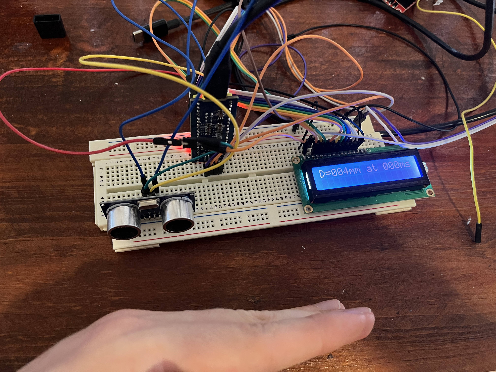
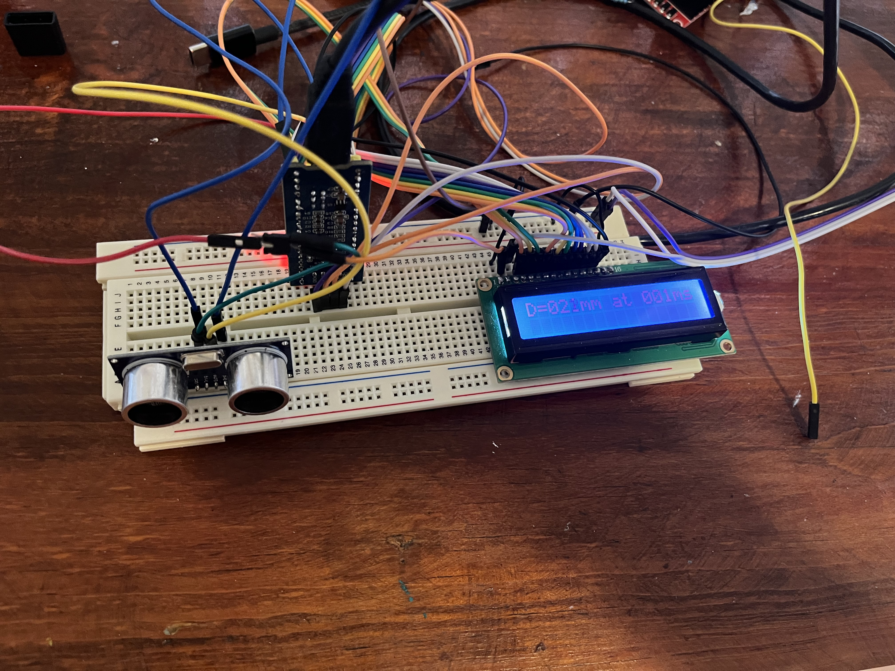
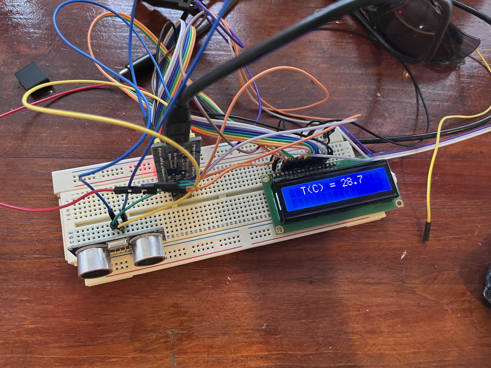
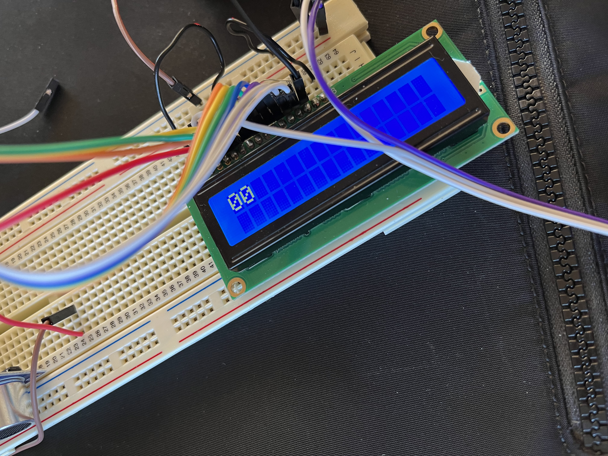
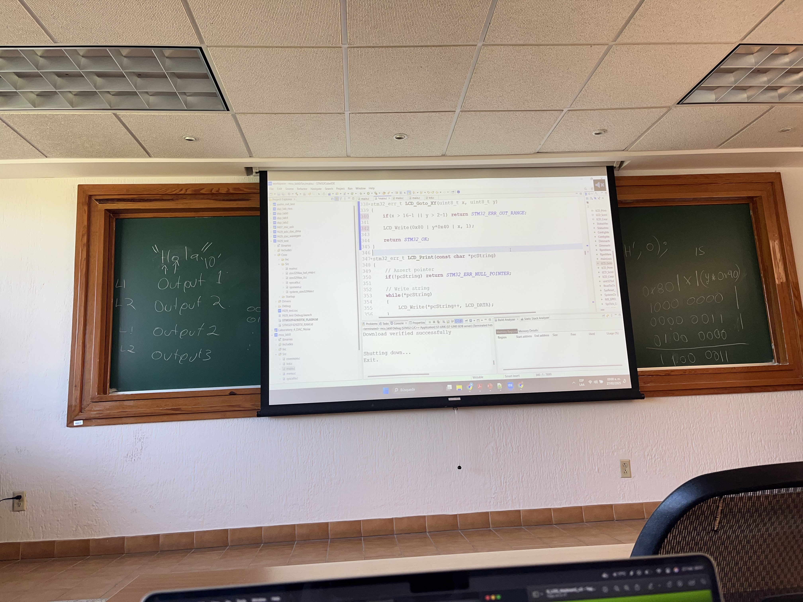

# STM32 F103C8T6 my works

We use a STM32F103C8T6, a 32-bit ARM Cortex-M3 microcontroller.

This is all my works with STM32F103C8T6 microcontroller during the class "Microcontroller" at the "Universidad Panamericana"

Some of projects we've done so far:
    - Connect the bluepile to a LCD screen HD44780
    - Manipulation of a Ultrasonic sensor
    - Manipulation of a gyroscope

Some pictures:

## Use of Ultrasonic Distance Sensor. HC-SR04

## Temperature of the processor

## LCD ON

## Room Class

Some description of the STM32F103C8T6 microcontroller:
 - STMicroelectronics
 - ARM Cortex-M3 32-bit architecture
 - Low-power processor
 - Speed up to 72MHz
 - Low cost
 - Flash memory: 64 Kbytes
 - SRAM memory: 20 Kbytes
 - Wide range of peripherals

Peripherals:
 - GPIO
 - ADC
 - SPI
 - I2C
 - CAN
 - UART
 - Timer
 - USB
 - DMA
